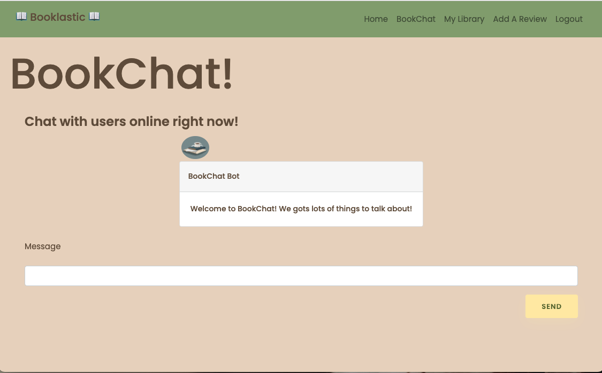

# [Booklastic-Blog-Place](URL)

TODO:  
Credit for login/signup styling  
Screenshots/gifs of app  
Video demo of usage  
Heroku link  

---
## Description

Welcome to Booklastic Blog Place! This application is a full-stack blog where bookies can bond. We aim to recruit users from around the world, to create a community of people who love to read! Come visit our site to share with our community what you have been reading and your review (including thoughts, opinions and questions) about your book. Save your review to your personal library page, but also share it with the world! From your personal library page, you can edit/delete your reviews if needed. From the homepage, you can read all reviews and leave comments on their! Interact with others by including questions in your review for them to comment on, or commenting on others reviews. Additionally, use our live chat feature to communicate with bookies in real time!

On the backend, we have a library database of books that stores both titles and authors and links to associated genres. You can choose from a book with already have, or add a new one! Additionally, we house a database of our user accounts (first name, email and encrypted passwords). Associated to each user are their blogs, books, and comments! 

We aim to help you find a good book recommendation (or a few) for the next time you are ready to head to the bookstore! 

Check out our deployed [project](https://fathomless-bastion-58602.herokuapp.com/)! 

---
## Table of Contents

* [Installation](#installation)
* [Packages](#packages)
* [Usage](#usage)
* [User Story](#user-story)
* [Acceptance Criteria](#acceptance-criteria)
* [Demo](#demo)
* [Screenshots](#screenshots)
* [Contributing](#contributing)
* [Questions](#questions)
* [License](#license)

---
## Installation

To install this project: 
1. Start by forking this repository on Github. 
2. Clone this project to your machine by using the `"git clone + URL"` command. 
3. Open the project with your favorite text editor, like VS Code (in your terminal, first type `"cd foldername"` then `"code ."`). 
4. `Install Node.js` from their website, if you have not already. Here are some additional [instructions](https://coding-boot-camp.github.io/full-stack/nodejs/how-to-install-nodejs).
5. `Install MySQL` from their website, if you have not already. Here are some additional [instructions](https://coding-boot-camp.github.io/full-stack/mysql/mysql-installation-guide).
6. Suggest installing [Nodemon](https://www.npmjs.com/package/nodemon) if you have not already.
7. This project includes a `package.json` file that specifies dependencies for this project, so be sure to run `"npm install"`. This will install the packages specified in the next section. 

---
## Packages

General Technologies: 
- [Javascript](https://www.javascript.com/)
- [HTML](https://html.com/)
- [CSS](https://developer.mozilla.org/en-US/docs/Web/CSS)
- [Node](https://www.npmjs.com/package/node)
- [Git](https://git-scm.com/)
- [Heroku](https://www.heroku.com/)
- [Insomnia](https://insomnia.rest/)

NPM Packages
- [nodemon](https://www.npmjs.com/package/nodemon) 
- [Express](https://www.npmjs.com/package/express)
- [dotenv](https://www.npmjs.com/package/dotenv)
- [MySQL2](https://www.npmjs.com/package/mysql)
- [Sequelize](https://www.npmjs.com/package/sequelize)
- [bcrypt](https://www.npmjs.com/package/bcrypt)
- [connect-session-sequelize](https://www.npmjs.com/package/connect-session-sequelize)
- [express-handlebars](https://www.npmjs.com/package/express-handlebars)
- [express-session](https://www.npmjs.com/package/express-session)
- [socket.io](https://www.npmjs.com/package/socket.io)

---
## Usage

After following the instructions in installation:
1. Open the database file in your terminal. 
2. Run command `"mysql -uroot -p"` and enter your password (note: keystrokes will not show).
3. Run command `"SOURCE schema.sql"` to set up the database and tables.
4. OK to `'quit'` MySql.
5. Optionally, run command `"npm run resetdb"` to replace steps 2-4 (enter password when prompted).
6. Create a file called `.env` in the root folder of the program. In this folder include the following information:  
  - `DB_NAME = 'ecommerce_db'`
  - `DB_USER = 'your username'`
  - `DB_PASS = 'your password'`
  - `SESSION_SECRET = 'your session secret'`
 
7. Open the "server.js" file in your integrated terminal. 
8. Run command `"npm run seed"` (or "node seeds/index.js") to seed the database if desired.
9. Run command `"npm run start"` (or "node server.js"). Alternatively, if you have Nodemon installed, run `"npm run watch"` (or "nodemon server.js").
10. Open `'localhost:3000'` in your browser and see the site in action.
11. Enter login/logout/signup requests as you please, create a new reviews or update/delete an existing one, or add comments to others reviews, or chat with the community!
12. When finished, run `CONTROL-C` in terminal to end stop nodemon, and trash the session.

---
## User-Story

AS A BOOK LOVER  
I WANT a community of people like me who love to read  
SO THAT I can express my thoughts on books I love (or don't!), further my understanding of books through dialogue with others, find new book recommendations, and share my passion for literature!

---
## Acceptance-Criteria
This project was completed for the Unversity of Washington Web Development Bootcamp and has the following requirements:
- Must use Node and Express web server
- Must be backed by a MySQL database with a Sequelize ORM 
- Must have both GET and POST routes for retrieving and adding new data
- Must be deployed with heroku (with data)
- Must utilize at least one new library, package or technology that we haven't discussed
- Must have a front end/UI utilizing Handlebars
- Must have a folder structure that meets the MVC paradign
- Must include authentication (sessions and cookies)
- Must project API keys in Node with environmental variables

---
## Demo

Check out this [video](URL) for a demonstration of this project.

___
## Screenshots

Entity Relationship Diagram

Wireframe

Shots from Website

GIF of Booklastic

---
## Contributing

This project was completed as a group as 'project 2' for the University of Washington Web Development Bootcamp. If you would like to contribute, please feel free and contact us with questions. The login page was created by ![https://codepen.io/ig_design] and the artists from Wissawa Khamsriwath, and other contributors made the icons for the buttons.

---
## Questions

If you have any questions feel free to contact our team:
1. Andrew Ryu | [Github](https://github.com/ryuandrew) | [email](andrewryu@outlook.com)
2. Brooke Love | [Github](https://github.com/brookelove) | [email](brookelovedevelops@outlook.com)
3. Jonathan Tran | [Github](https://github.com/JTreezy) | [email](digitalsigna@gmail.com)
4. Haley Seymour | [Github](https://github.com/hseymo) | [email](haleycseymour@comcast.net)

---
## License

[MIT License](./LICENSE)  

Copyright (c) 2022

Permission is hereby granted, free of charge, to any person obtaining a copy
of this software and associated documentation files (the "Software"), to deal
in the Software without restriction, including without limitation the rights
to use, copy, modify, merge, publish, distribute, sublicense, and/or sell
copies of the Software, and to permit persons to whom the Software is
furnished to do so, subject to the following conditions:

The above copyright notice and this permission notice shall be included in all
copies or substantial portions of the Software.

THE SOFTWARE IS PROVIDED "AS IS", WITHOUT WARRANTY OF ANY KIND, EXPRESS OR
IMPLIED, INCLUDING BUT NOT LIMITED TO THE WARRANTIES OF MERCHANTABILITY,
FITNESS FOR A PARTICULAR PURPOSE AND NONINFRINGEMENT. IN NO EVENT SHALL THE
AUTHORS OR COPYRIGHT HOLDERS BE LIABLE FOR ANY CLAIM, DAMAGES OR OTHER
LIABILITY, WHETHER IN AN ACTION OF CONTRACT, TORT OR OTHERWISE, ARISING FROM,
OUT OF OR IN CONNECTION WITH THE SOFTWARE OR THE USE OR OTHER DEALINGS IN THE
SOFTWARE.